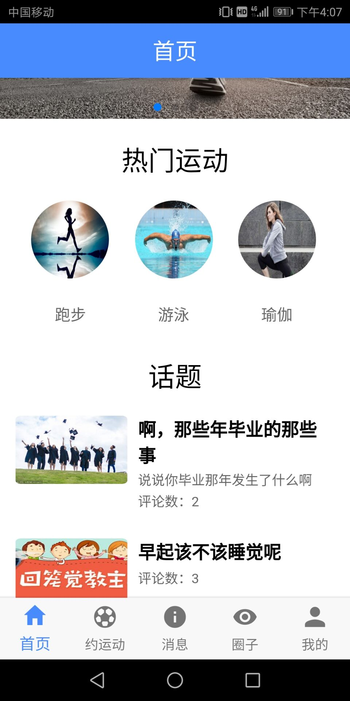

# 悦动

## 项目地址

* [前端Github](https://github.com/Sunhuizhe/yuedong-project)

* [后台Github](https://github.com/GuoLiBin6/review)

* [HostedRedmine](http://10.7.1.5/projects/abc/issues?c%5B%5D=tracker&c%5B%5D=status&c%5B%5D=priority&c%5B%5D=subject&c%5B%5D=assigned_to&c%5B%5D=updated_on&f%5B%5D=status_id&f%5B%5D=&group_by=&op%5Bstatus_id%5D=%2A&page=1&set_filter=1&utf8=%E2%9C%93)

## 项目简介

生活水平在提高，学生坐在教室学习，白领坐在办公室办公，很多人一天下来也没有多少运动量，对身体健康有明显的影响。

**悦动**为喜爱运动者提供了一个信息交流的平台。你可以在这里发布活动，让别的小伙伴参加。也可以和别的小伙伴约一场酣畅淋漓的运动。

## 项目成员

1. 耿康宁（项目经理）

   * Email:948891770@qq.com
 
   * [Github](https://github.com/gengkangning)

2. 郭丽斌（后台代码开发，测试，UI）

   * Email:782518577@qq.com
 
   * [Github](https://github.com/GuoLiBin6)
 
3. 孙慧喆（前端代码开发，测试，UI）

   * Email:674277449@qq.com
 
   * [Github](https://github.com/Sunhuizhe)

4. 黄纯浩（前端代码开发）

   * Email:1575994297@qq.com
 
   * [Github](https://github.com/hh970304)
 
 ## 项目截图
 
 
 
 
 
 
 
 
 
 
 
 
 
 
 
 
 
 
 
 
